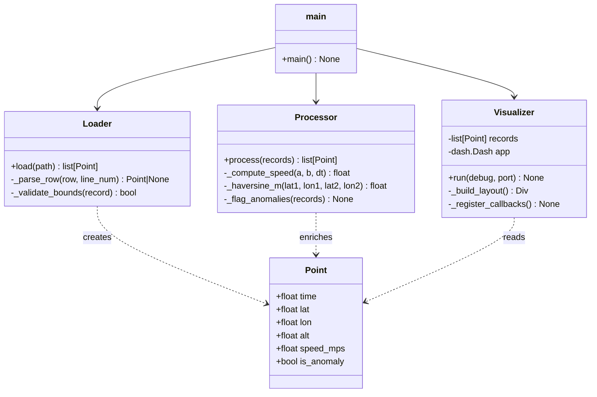

# SPEC.md — Car Track Visualiser


---

## 1. Overview

A Python application that loads a GPS track from a CSV file and renders an
interactive, time-accurate animation of the vehicle's position on a 2-D map.
The application runs in the browser via **Plotly Dash**.

---

## 2. Components & Responsibilities

### 2.1 `Point` — Data Model (`src/point.py`)

A `dataclass` representing a single, validated GPS sample.

| Field | Type | Description |
|---|---|---|
| `time` | `float` | Elapsed seconds from start |
| `lat` | `float` | WGS-84 latitude |
| `lon` | `float` | WGS-84 longitude |
| `alt` | `float` | Altitude (m ASL) |
| `speed_mps` | `float` | Derived: speed to *next* point (m/s) |
| `is_anomaly` | `bool` | Flagged by validator |

`speed_mps` is computed after loading, not stored in CSV.

---

### 2.2 `Loader` — I/O & Parsing (`src/loader.py`)

**Single responsibility:** read a CSV file and return a list of `Point`.


Edge-case handling (see §5).

---

### 2.3 `Processor` — Derived Metrics (`src/processor.py`)

**Single responsibility:** enrich a list of `Point` with speed and anomaly flags.

Anomaly detection: a point is flagged when the implied speed between
consecutive samples exceeds **250 km/h** (physically implausible for a car).

---

### 2.4 `Visualizer` — Visualisation & UI (`src/visualizer.py`)

**Single responsibility:** build and serve the Dash application.


UI elements:
- **Map** — Scattermapbox showing the full path (grey) and car marker (colour).
- **Play / Pause button**
- **Speed selector** — 1×, 2×, 5×
- **Timeline slider** — draggable; synced with animation.
- **Info panel** — current time, speed, altitude, anomaly warning.

---

### 2.5 `main.py` — Entry Point

Wires everything together. No business logic here.


---

## 3. Data Flow

```
car_track.csv
      │
      ▼
 Loader.load()
  ├─ reads CSV rows
  ├─ skips / logs malformed rows
  └─ returns list[Point]  (raw)
      │
      ▼
 Processor.process()
  ├─ computes speed
  ├─ flags anomalies
  └─ returns list[Point]  (enriched)
      │
      ▼
 Visualizer.__init__(records)
  ├─ stores records
  ├─ builds layout
  └─ registers callbacks
      │
      ▼
 Visualizer.run()  →  browser at localhost:8050
```

---

## 4. Class / Component Diagram



---

## 5. Edge-Case Handling

| Situation | Strategy |
|---|---|
| Missing / empty field | Skip row; log warning with line number |
| Non-numeric value in numeric column | Skip row; log warning |
| Duplicate timestamps | Keep first occurrence; log info |
| Out-of-range lat/lon (lat outside ±90, lon outside ±180) | Skip row; mark as malformed |
| Implied speed > 250 km/h | Keep row but set `is_anomaly = True`; highlight on map |
| Altitude outlier (> 9000 m or < −500 m) | Flag as anomaly; do not discard |
| Fewer than 2 valid rows after cleaning | Raise `ValueError` with clear message |
| File not found | Raise `FileNotFoundError` with path in message |
| Empty file / header-only | Raise `ValueError` |

All skipped rows are collected into a summary printed after loading, not
scattered as individual print statements.

---

## 6. Extended Features Chosen

| Feature                     | Justification |
|-----------------------------|---|
| Speed control (1×, 2×, 5×)  | Low implementation complexity with high user value, enabling flexible exploration of the dataset |
| Timeline slider             | Enables non-linear navigation through the dataset, allowing users to directly inspect specific time points rather than relying solely on sequential playback |
| Speed / altitude panel      | Adds real-time metrics that help interpret the movement beyond spatial visualization alone |
| Anomaly detection           | Provides lightweight rule-based detection of outliers, improving visibility into potential data quality issues |

Features **not** implemented and why:
- Heading display - although heading can be computed from consecutive points, I chose not to include it because the direction of movement is already visually apparent from the trajectory on the map. Given the
  assignment's emphasis on clarity over feature richness, I prioritized
  keeping the interface simple and focused.
